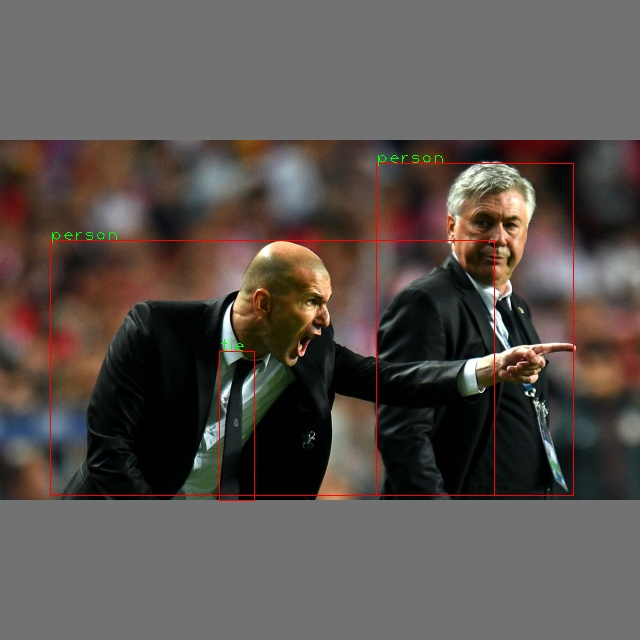

## 介绍

使用libtorch部署yolov5模型，由于c++没有torchvision,只能使用OpenCV处理图像，所以最好模型训练时同样是使用OpenCV进行图像处理。这里挑选ultralytics公司的[Yolov5](https://github.com/ultralytics/yolov5.git)提供的预训练模型。

> [Google colab Notebook](https://colab.research.google.com/drive/1t5DVj-woC8D2c3dYPoFxnf6lEX4KA1I_#scrollTo=TkTBYwRdAunh)
## 环境准备

1. 需要下载libtorch,解压放在工程目录下
2. GCC需要支持C++11标准

## 准备工作

0. 我们需要到[release页面](https://github.com/ultralytics/yolov5/releases)下载yolov5的预训练模型，例如选择yolv5s.pt

1. 然后使用`trace.py`转换成scrptmodel:

```bash
git clone https://github.com/ultralytics/yolov5.git
cd yolov5
python3.7 export.py --data data/coco128.yaml --weights yolov5s.pt --include torchscript
```
我们会得到一个yolov5s.torchscript文件

## 环境确认
克隆我们的代码 复制模型到当前目录，复制libtorch到当前目录并解压
```bash
git clone https://github.com/Hexmagic/libtorch_Yolov5.git
cd libtorch_Yolov5
```
这是最终的目录情况，其中libtorch是我们解压的libtorch包，yolov5s.torchscript是我们上一步导出的script模型
```
CMakeLists.txt      README.md           data                include             main.cpp            yolov5s.torchscript
LICENSE             assets              fonts               libtorch            src
```

编译代码:
```bash
mkdir build&&cd build
cmake ..
make -j4
cd ..
./build/main yolov5s.torchscript data/images/zidane.jpg
```


> 这里没有缩放到原图，只是简单显示。
